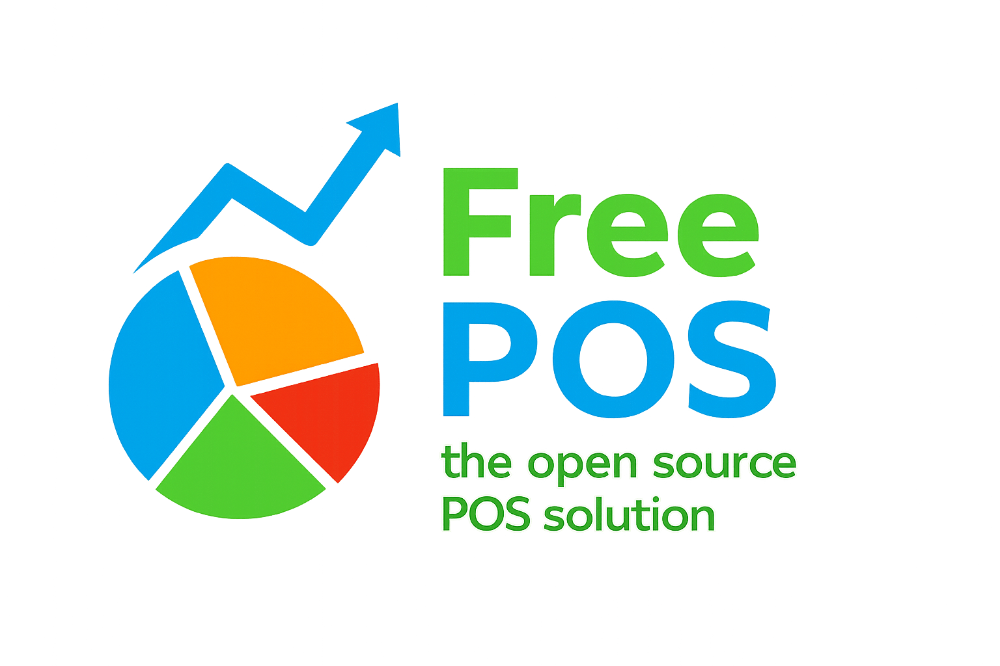

# FreePOS - Open Source Point Of Sale

## An intuitive & modern web based POS system for retail businesses

FreePOS uses the power of the modern web to provide an easy to use & extensible POS system.

It supports standard POS hardware including receipt printers, cashdraws and barcode scanners. Runs on any device with a web browser.

With a rich administration dashboard and reporting features, FreePOS brings benefits to managers and staff alike.

Take your business into the cloud with FreePOS!

## 🚀 Quick Start

1. Configure your web server to serve from the `public/` directory
2. Access different applications:
   - Main POS: `/` or `/pos`
   - Admin: `/admin`
   - Kitchen Display: `/kitchen`
   - Customer Portal: `/customer`

To find out more about FreePOS, head over to [wallacepos.com](https://wallacepos.com)

If you find that FreePOS is the perfect companion for your business, please donate to support further development.

[](#)

## Server Prerequisites

FreePOS requires:

1. PHP 7/8 with the following extensions: cURL & GD.

2. Node.js installed along with the socket.io library

    For a Debian distro:

    ```
        sudo apt-get update
        sudo apt-get install nodejs && apt-get install npm
        cd %/your_install_dir%/api
        sudo npm install socket.io
    ```

## Installation & Startup

1. Clone the latest FreePOS release to %your_install_dir% if you haven't done so already.
   
2. Run `composer install` in your install directory to update PHP dependencies (you may need to install composer first).

3. Visit /installer in your browser & follow the installation wizard.

4. Login to the admin dashboard at /admin, from the menu go to Settings -> Utilities and make sure the feed server has been started successfully.